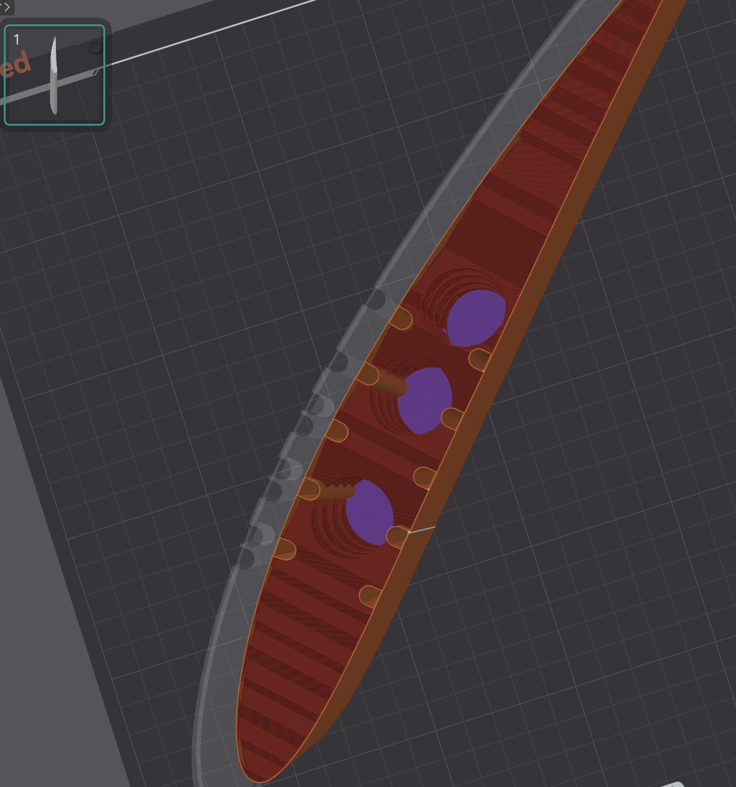

### Forma Bonum: reinforcing 3d printed parts for the professional UAV market.

We explore reinforcing 3d printed parts with small, distributed pultruded carbon fiber elements for it's usage as the main method of construction of production-ready UAVs in the medium size category (25 kg - 150 kg AUW).

  
   
  <em>sliced wing section with reinforcement channels and optimized infill.</em>

The following repsitory acts as storage for the all the projects analysis, tests and code. Refer to (summary.md) to learn more about the motivation, rationale and the extended description.

### Index

The repo is organized as follows:

- `wing_assembler` is a python package used to define entire wing sections. It provides reinforcement-placement help relevant for this project, slicing and joinery, and modifiers for each section, ready to add to the slicer of choice.
- `analysis` holds jupyter notebooks running through initial sizing and estimates for the method.
- `tests` has all experiments and material characterizations performed for the project.
- `defiinitions` are models used for testing or analyses (wing models so far only). Defined using `wing_assembler`.
- `docs`: other miscellaneous documents for the project. 