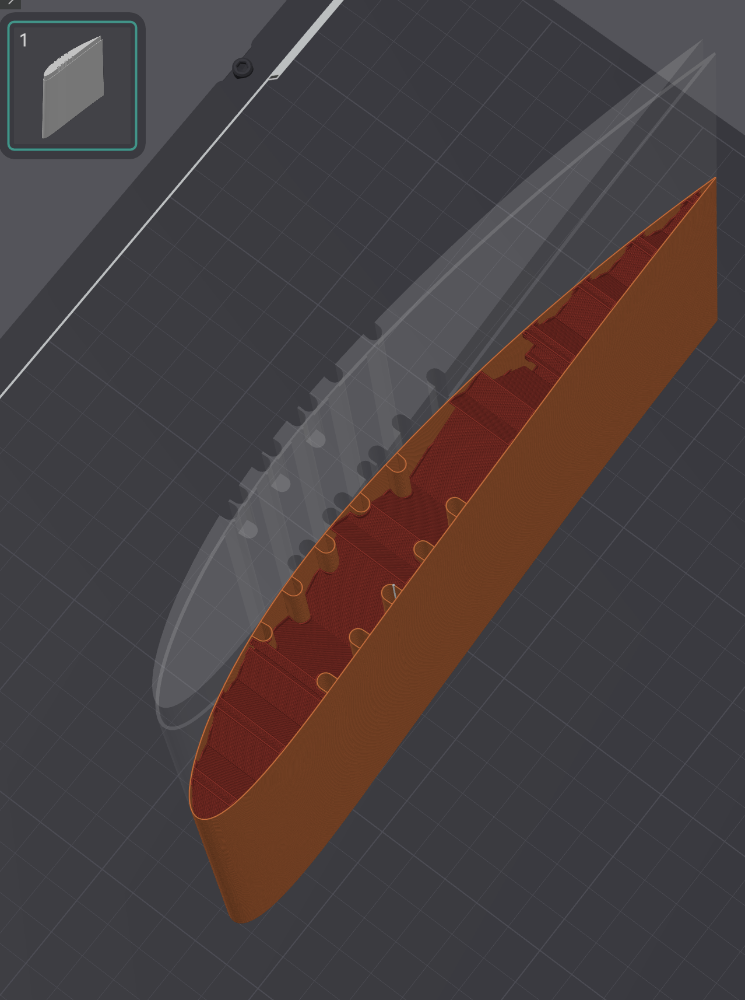
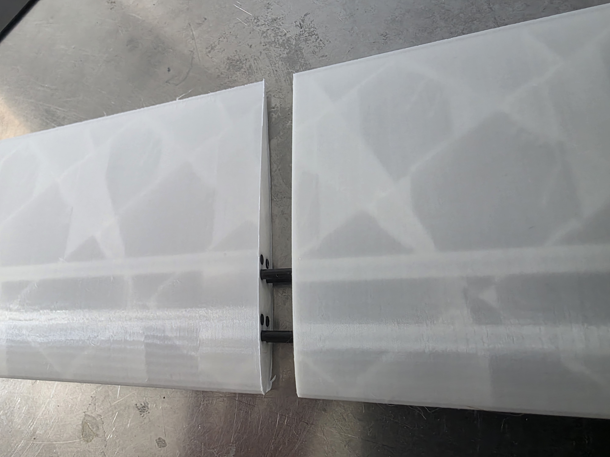
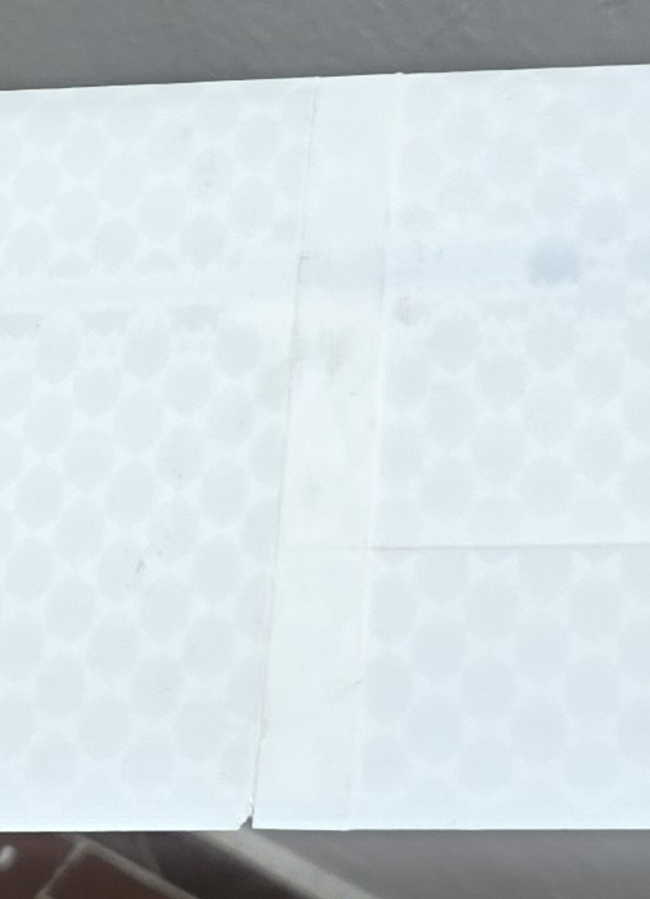
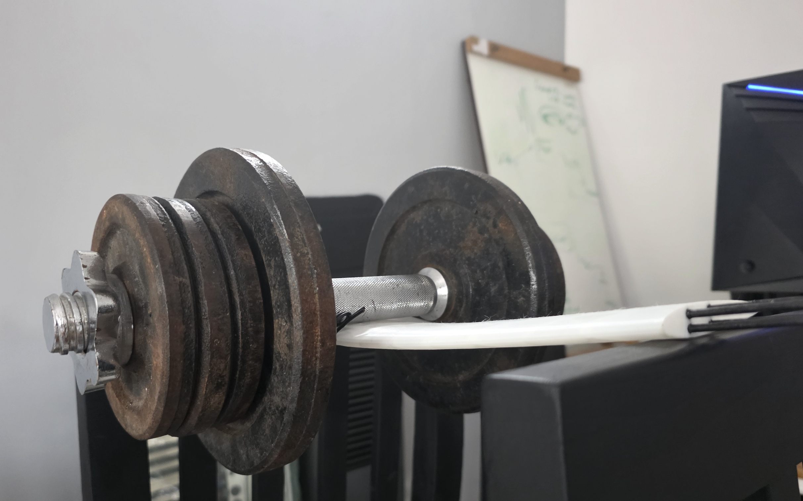
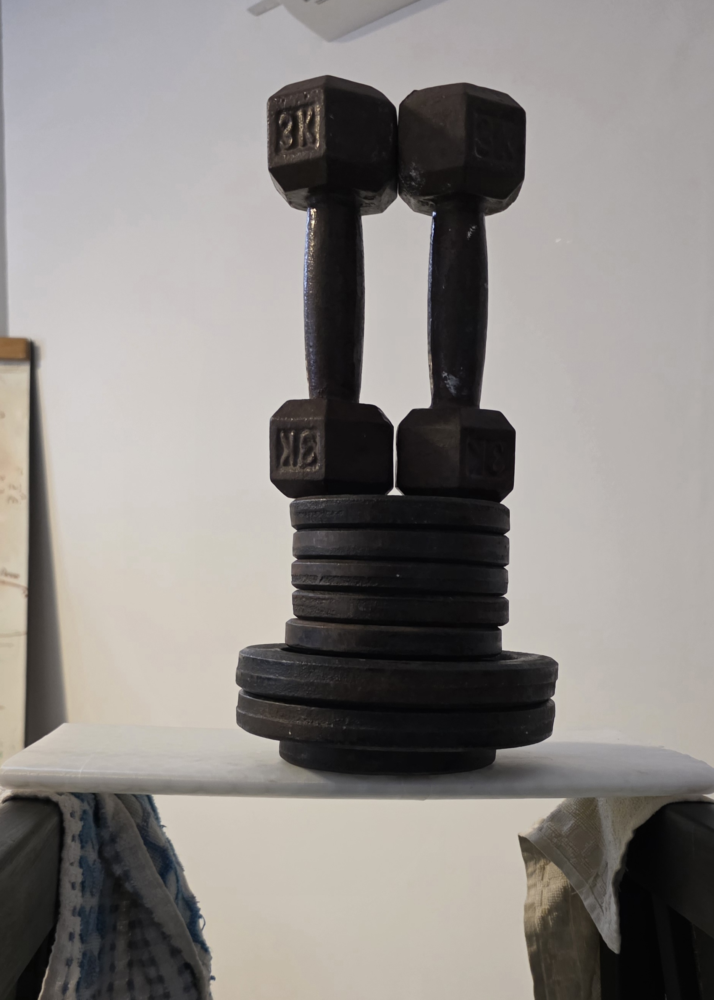

### TL;DR:

Using 3d printed reinforced parts, I believe we can graudate 3d printing airframes in the UAV market from prototyping into something production-ready, which can be a competitive and cost effective construction method at a fraction of the cost of laminated composites, no special tooling, and yet with competitive performance.

### Abstract

The objective of this is to explore a technique of reinforced 3d printed plastics aimed at production-ready parts for UAVs. 

**It consists of**: A plastic matrix reinforced with several small-diameter pultruded carbon fiber rods. 

  
   
  <i>Sliced wing section, printed standing on end, with the rod bores running spanwise through it. Latest iteration, optimizing rod position and infill.</i>

Final geometry ready to fly is made entirely in this manner, and is meant to avoid or reduce as much as possible any form of surface treatment on the part. The philosophy: From printer to flight.

The pieces are made in sections, trying to make as big sections as possible, carbon fiber rods for reinforcement are inserted and glued afterwards. Then the pieces are simply connected with each other. Rods also help as a guide when assembling two sections.

  
  
   
  <i>Joining two small airfoil sections for a test. Left: illustrative test. Right: section joined using sleeve (male-female) method.</i>

### Rationale and motivation for the idea

Pultruded carbon rods are produced "en-masse", are standard, easy to source, cheap and can have varying ranges of quality and performance. 
Looking at cross-section of the part, it immediately brings to mind reinforced concrete. 

One of the most common methods to reinforce 3d printed parts for thin profiles like wings is to use a large diameter, hollow carbon fiber tube at the thickest point. The method is simple, but it has some disadvantages in both sourcing the exact diameters and cost of the tube as it grows larger. 
In terms of structures, it has less freedom in how to position the rod/tube to make the most out of the carbon fiber relative to a particular bending or stress direction.

For the case of wings, which is the topic of analysis as it is one of the most demanding elements in terms of material perfomance and weight, this means the rod is positioned near the neutral axis. 

In contrast, a high-end CFRP build (monocoque layout) puts the material mostly in the outer part and alternatively a central spar.

This is in an entirely different league in terms of cost and complexity. A carbon fiber layup is the state of the art but needs to account for layout process and molds, and we require as well a careful design for other failure modes (without getting into details on advanced composite wing making, mostly because I know little about).

The proposed technique goes in a different direction: **Move the reinforcing material as close to the skin as possible, using a large set of small, pultruded rods**.

It leverages the freedom a 3d printer gives us in terms of laying material and complex shapes, which allows to build channels where the rods are inserted. This way, depending on the loads we expect, we can place the rods to reinforce in the perfect spot. 

Some benefits to this tradeoff besides the redistribution of the reinforcement: the load transfer is distributed along a larger relative surface vs one single rod or tube. Therefore have more freedom in placing that reinforcement in the first place. 

It also frees us to build along the z axis, since if we choose to reinforce it, what would be the worse load axis it now becomes the reinforced one. This is specially useful as for aerodynamic shapes it is quite convenient to build with the print axis oriented along the span, for quality reasons.  

And we use the plastic where it's good at: forming the perfect shape for aerodynamic loads, transferring the loads to the reinforced element. This combo provides us with the possibility to easily implement topology optimization, multi-material usage, and complex lattices.

### Positioning on the map: 

It is intended to compete with advanced manufacturing techniques, one or two steps down of state of the art CRPF. 
Although there is much room to improve, initially it is intended to become a better way of manufacturing prototypes, where 3d printing is already the reality for the small UAV world, then move the bar into production for low-mid cost builds.

For designs with low production volumes it is even more interesting as the development of the mold in composites takes out quite a large portion of the cost. It won't ever beat a well crafted, aerospace grade composites part, but it may come close, at a fraction of the cost.

### Enabling technologies:

- Research on high performance 3d printed plastics,
- Large format 3d printers and advanced processes.
- Software enabled designs and optimizations.
- Economics of scale of pultruded carbon elements. 

All 4 things (except for pultruded rods, which we may assume as a standard and settled market) have still room to improve.

### Real world tests

##### Backstory. Initial tests:

So far, tests made are not laboratory grade, but are quite promising. A few initial promising tests that kick off the entire study, showed that the without much care and build effort, and using simply PLA, the rods where the failing element in the reinforced structure. The images and numbers behind that test are worked out in [`tests/experiment-01/ellipse_test.ipynb`](tests/experiment-01/ellipse_test.ipynb).

  
   
  <i>Thin airfoil shape reinforced with 2 pairs of 3mm rods</i>

This was encouraging, since it means it validated the constructive method and adhesive used. What is even more encouraging was the room for improvement. As I said previously, only standard PLA and infill was used, and for adhesive it's even more homemade: superglue + standard 2 part household epoxy.

#### Wing test and build

The closest test made that is comparable to a real world case so far is that of the **mk2** wing, defined in [`definitions/mk2/`](definitions/mk2/) (NACA 4412, 1600 mm span, 200 → 160 mm chord, 20 × 3 mm rods spent as 5/3/1/1 pairs over four 200 mm printed sections, panel ≈ 545 g). The piece tested below is its two outboard sections, 02 + 03, bonded across their printed joint. 

  
   
  <i>Naca 4412, chord 180mm, 1 pair of rod reinforcement. 18 Kg on a 3 point bending test with little deflection and no failure. Total weight less than 200 g</i>

The motivation for this build was to test against real geometries and loads. Chanzy & Keane (2018), *Analysis and experimental validation of morphing UAV wings*, The Aeronautical Journal 122 (1249), 390–408 ([doi:10.1017/aer.2017.130](https://doi.org/10.1017/aer.2017.130)) is one of the few papers I could find where the wing is weighed once built, and where we know the weight of the aircraft as well. Their aircraft, the Southampton DECODE Mk IV, is a 15 kg MTOW UAV with 2.95 m span, 0.33 m chord and 0.91 m² of wing, built as glass-clad foam over SLS nylon ribs and a carbon spar. The conventional wing weighs 976 g per panel (the paper's "54 g each" makes it per panel, not per wing), so about 1.95 kg for the whole wing, or 13 % of MTOW. That gives us a measured reference for a conventional build in the class this method is aiming at. 

### Models and theory

We have explored in full, so far, 2 models for beam theory on this project: standard beam theory and transformed-section method.

The first method accounts for an analysis of only the rods contributing to stiffness and resistance in bending of the wing. If we want to account for the plastic's share, we must use something like the transformed section method.

- **Rods only, idealized:** [`analysis/idealized_rods_only.ipynb`](analysis/idealized_rods_only.ipynb). The rods are booms carrying all the direct stress, and the plastic is assumed perfect in shear. It is run on the mk2 panel, first as a straight 1 m cantilever and then station by station along the real rod ladder.
- **Transformed section:** [`tests/experiment-01/ellipse_test.ipynb`](tests/experiment-01/ellipse_test.ipynb). $EI$ is summed over rods, wall and infill about the $E$-weighted neutral axis, and calibrated against the 80 kgf ellipse test. 

Both models more than confirm the technique, at least in bending. But much more work needs to be done to explore 3d effects on complex sections like the wing root, wingbox-fuselage attachment, etc. 

Importantly, we also need to verify that the plastic + lattice used in the construction is enough to handle torsion properly to prevent flutter or other undesired effects, since in the proposed reinforcement technique torsion is expected to be handled entirely by the plastic matrix. 

Therefore, a proper FEM model accounting for the rod elements, wall, infill lattice + any other special section, is potentially required to get the most out of this method. Calibrating such a model is no easy feature and requires more empirical tests. which are luckily cheap to perform.

### Software. 

This entire idea relies heavily on software design tooling, particularly due to 2 main factors:

- Choosing many small rods as reinforcement adds complexity on the design and assembly. Ideally not as much complexity as what CFRP requires, but it is definitely a step up in complexity compared to the usage of a single main spar. 

- The freedom we have with 3d printers is large. We can choose to add different densities, different lattices, and even different materials depending on the printer we use. This amount of freedom is almost a "curse", as finding the optimum geometry is not trivial. Many empirical tests and optimization techniques like an adapted topology optimization will be needed to achieve the most of this method.

For the first issue, a good example is what's done in `wing_assembler`. It's basically a seed, but it has prooven already very useful for tests. What this package does, is start from the definition of a wing (given a planform/airfol) and an initial seed of rod positioning, and it returns a ready-to-go set of .stl models, that can be set into the printer's slicer. It basically takes care of modelling the tubes for the rods, adjusting as required, slicing the parts and modelling the lip-joints, and providing a set of modifiers to be used in the slicer where different densities can be selected (as they are the most critical sections)

### Where this technique is relevant (preliminary).

We start to be competitive, as the test (hopefully) shows, on the 10kg empty weight class and above, where the printer can play with the infill densities. We can start playing with 2 walls, different infill lattices and densities, we can position better the rods, etc. 

It is in fact one of the intention of this project is to learn up to which class of aircraft this methodology can be valid. One limiting factor is of course the build size of the printer, assuming printing diagonally on consumer-grade printers we may easily get up to 700mm chords.
For printers with a larger print bed than 500mm, we need to start considering industrial-grade printers. 
