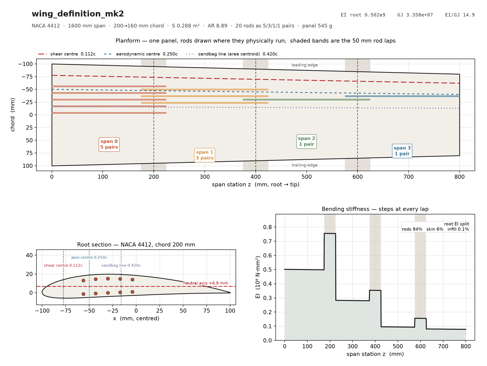

# mk2 — 5/3/1/1 demo panel

NACA 4412 · 1600 mm span · 200→160 mm chord · S 0.288 m² · AR 8.89
20 × 3 mm rods as 5/3/1/1 pairs · four 200 mm print sections · panel ≈ 545 g



Supersedes the mk1 4/3/2/1 layout (`../wing_definition_4321.py`). Same planform,
same rods, same lattice — only the spanwise split changed, because peak rod
stress is at the **root** (117.6 MPa tension / 113.0 compression at n=1, against
46 at the first lap) and mk1 spent pairs outboard where nothing was asking for
them.

WL 100, uniform lift:

| | EI root | rod compr. @n=1 | tip @7 g | first failure | by what |
|---|---|---|---|---|---|
| mk1 4/3/2/1 | 0.406e9 | 134.9 MPa | 186.6 mm | 3.26 g | rod foundation |
| **mk2 5/3/1/1** | **0.502e9** | **113.0 MPa** | **177.1 mm** | **3.78 g** | **wall shear** |

Tip figures include the Timoshenko shear term (10 mm of them). mk2's first
failure is a *shell* mode the rod split cannot move — what the re-split buys is
the rod ladder, 4.59/5.16 g against mk1's 3.84/4.32.

## Regenerate

```bash
cd structures/wing-assembler
python3 analyse.py       definitions/mk2/wing_definition_mk2.py
python3 load_matrix.py   definitions/mk2/wing_definition_mk2.py
python3 plot_planform.py definitions/mk2/wing_definition_mk2.py
wing-assembler definitions/mk2/wing_definition_mk2.py
python3 ../tests/geometry_check.py definitions/mk2/output --chord 200 --span 215
```

## output/

Four print sections, 15 STLs, all **watertight, one solid, inside the station
envelope** (`tests/geometry_check.py`).

| section | z | chord | bores | joints |
|---|---|---|---:|---|
| 00 | 0–200 mm | 200.0 → 190.0 | 8 | root face, male peg |
| 01 | 200–400 | 190.0 → 180.0 | 9 | female + male |
| 02 | 400–600 | 180.0 → 170.0 | 5 | female + male |
| 03 | 600–800 | 170.0 → 160.0 | 2 | female, free tip |

`*_bell_modifier`, `*_rod_joint_modifier` and `*_sleeve_modifier` are **PrusaSlicer
modifier volumes**, not parts. Load them onto the matching `_part.stl` to raise
infill locally; do not print them.

## Print orientation is structural, not a convenience

**Standing on end, span vertical.** Two consequences that the model depends on:

1. The layer plane is the airfoil cross-section, so a rhomboid/diamond infill
   puts struts running **skin to skin** — a stretch-dominated truss rather than a
   bending-dominated foam. That is worth 3.78 g → 5.31 g of first failure
   (`LEARNINGS.md` §4).
2. Nothing printed is continuous along the span; every layer boundary is a
   potential separation. **The rods are the only material that crosses them.**
   Their 94 % of root EI understates their importance — they are also the entire
   spanwise tensile path.

Record the actual infill pattern and density on the build, or neither point can
be checked afterwards.
